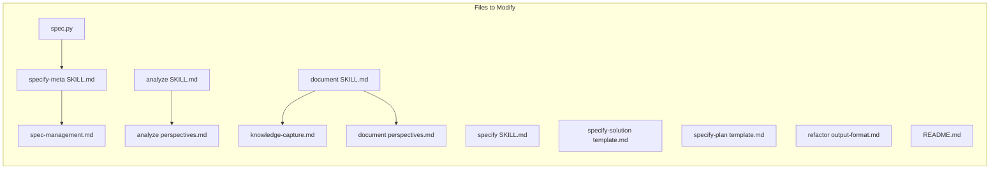

# Solution Design Document

## Validation Checklist

### CRITICAL GATES (Must Pass)

- [x] All required sections are complete
- [x] No [NEEDS CLARIFICATION] markers remain
- [x] Architecture pattern is clearly stated with rationale
- [x] **All architecture decisions confirmed by user**
- [x] Every interface has specification

### QUALITY CHECKS (Should Pass)

- [x] All context sources are listed with relevance ratings
- [x] Project commands are discovered from actual project files
- [x] Constraints → Strategy → Design → Implementation path is logical
- [x] Every component in diagram has directory mapping
- [x] Error handling covers all error types
- [x] Quality requirements are specific and measurable
- [x] Component names consistent across diagrams
- [x] A developer could implement from this design
- [x] Implementation examples use actual schema column names (not pseudocode), verified against migration files
- [x] Complex queries include traced walkthroughs with example data showing how the logic evaluates

---

## Constraints

CON-1 **Plugin cache**: Changes target `~/.claude/plugins/cache/the-startup/start/3.2.1/`. Plugin updates overwrite this directory. Changes must be replicated upstream.
CON-2 **Python 3**: spec.py uses Python 3 standard library only (pathlib, re, argparse, sys).
CON-3 **Markdown only**: All skill files are Markdown (SKILL.md, template.md, reference/*.md). Changes are text replacements — no build step.
CON-4 **Breaking change**: Legacy `docs/specs/` and legacy file names (`product-requirements.md`, `solution-design.md`, `implementation-plan.md`) will no longer be recognized.

## Implementation Context

### Required Context Sources

#### Code Context
```yaml
- file: skills/specify-meta/spec.py
  relevance: CRITICAL
  why: "Central script for all spec directory operations. Contains all legacy fallback code to remove."

- file: skills/specify/SKILL.md
  relevance: HIGH
  why: "Contains Write/Edit permissions that grant docs/** access."

- file: skills/specify-meta/SKILL.md
  relevance: HIGH
  why: "Description mentions docs/specs/ fallback."

- file: skills/analyze/SKILL.md
  relevance: HIGH
  why: "Interface and constraints reference docs/ output locations."

- file: skills/analyze/reference/perspectives.md
  relevance: HIGH
  why: "Maps perspectives to docs/ output locations."

- file: skills/document/reference/knowledge-capture.md
  relevance: HIGH
  why: "All examples use docs/ paths. 50+ references."

- file: skills/document/reference/perspectives.md
  relevance: MEDIUM
  why: "Capture perspective maps to docs/ paths."

- file: skills/specify-solution/template.md
  relevance: MEDIUM
  why: "Contains @docs/ references in examples."

- file: skills/specify-plan/template.md
  relevance: MEDIUM
  why: "References docs/ paths in context priming."

- file: skills/refactor/reference/output-format.md
  relevance: MEDIUM
  why: "References docs/refactor/ for saved plans."

- file: skills/specify-meta/reference/spec-management.md
  relevance: MEDIUM
  why: "Documents legacy fallback behavior."

- file: README.md
  relevance: MEDIUM
  why: "Documents directory structure including docs/."
```

### Implementation Boundaries

- **Must Preserve**: All skill behavior and workflow logic. Only paths and fallback code change.
- **Can Modify**: All files listed in context sources above. spec.py logic for path resolution and legacy support.
- **Must Not Touch**: Skill workflow logic (SKILL.md workflow sections), template document structure, plugin.json, output-styles/.

### External Interfaces

No external interfaces. This is an internal refactoring of path references and dead code removal.

### Project Commands

```bash
# Verify Python script works after changes
python3 skills/specify-meta/spec.py --help

# Validate no docs/ references remain (post-migration audit)
grep -r "docs/" skills/ --include="*.md" --include="*.py" -l

# Test spec creation
python3 skills/specify-meta/spec.py "test-feature"

# Test spec reading
python3 skills/specify-meta/spec.py 001 --read
```

## Solution Strategy

- **Architecture Pattern**: Find-and-replace refactoring with dead code removal. No new abstractions.
- **Integration Approach**: Direct text edits to existing files. No new files created (except migration guide).
- **Justification**: This is a path migration, not a feature. The simplest approach — direct edits — is the correct one. No indirection or configuration layer is warranted.
- **Key Decisions**:
  - All `docs/` → `.start/docs/` for knowledge capture paths
  - Remove legacy fallback code entirely (no compatibility layer)
  - Remove deprecated template fallback from spec.py (templates/ directory)

## Building Block View

### Components



### Directory Map

**Component**: spec.py (Python script)
```
skills/specify-meta/
├── spec.py                    # MODIFY: Remove LEGACY_SPECS_DIR, resolve_doc_path, template fallback
├── SKILL.md                   # MODIFY: Remove "Falls back to docs/specs/" from description
└── reference/
    └── spec-management.md     # MODIFY: Remove Legacy Fallback section
```

**Component**: Analyze skill
```
skills/analyze/
├── SKILL.md                   # MODIFY: Update interface location, constraint text
└── reference/
    └── perspectives.md        # MODIFY: Update output locations column
```

**Component**: Document skill
```
skills/document/
├── SKILL.md                   # No changes needed (paths are in references, not SKILL.md)
└── reference/
    ├── knowledge-capture.md   # MODIFY: Update all docs/ paths to .start/docs/
    └── perspectives.md        # MODIFY: Update Capture perspective paths
```

**Component**: Specify skill
```
skills/specify/
└── SKILL.md                   # MODIFY: Remove docs/** from allowed-tools
```

**Component**: Solution & Plan templates
```
skills/specify-solution/
└── template.md                # MODIFY: @docs/ → @.start/docs/

skills/specify-plan/
└── template.md                # MODIFY: docs/ → .start/docs/ in context priming
```

**Component**: Refactor skill
```
skills/refactor/
└── reference/
    └── output-format.md       # MODIFY: docs/refactor/ → .start/docs/refactor/
```

**Component**: Framework README
```
README.md                      # MODIFY: Update directory structure diagram
```

### Interface Specifications

No new interfaces. This migration modifies path strings only.

#### Data Storage Changes

No database or storage changes. Framework uses filesystem directories only.

#### Internal API Changes

**spec.py CLI interface** — unchanged:
```
spec.py "feature-name"           # Create new spec (unchanged)
spec.py NNN --read               # Read spec metadata (simplified output, same format)
spec.py NNN --add template-name  # Add template (simplified mapping)
```

The CLI contract remains identical. Only internal resolution logic changes.

#### Application Data Models

No data model changes.

#### Integration Points

No external integrations.

### Implementation Examples

#### Example 1: spec.py Simplified `get_next_spec_id()`

**Why this example**: Shows the core simplification — removing dual-directory scanning.

```python
# BEFORE (current)
def get_next_spec_id() -> str:
    max_id = 0
    for specs_dir in [SPECS_DIR, LEGACY_SPECS_DIR]:  # scans two dirs
        if specs_dir.exists():
            for dir_path in specs_dir.iterdir():
                if dir_path.is_dir():
                    match = re.match(r'^(\d{3})-', dir_path.name)
                    if match:
                        num = int(match.group(1))
                        if num > max_id:
                            max_id = num
    return f"{max_id + 1:03d}"

# AFTER (simplified)
def get_next_spec_id() -> str:
    max_id = 0
    if SPECS_DIR.exists():
        for dir_path in SPECS_DIR.iterdir():
            if dir_path.is_dir():
                match = re.match(r'^(\d{3})-', dir_path.name)
                if match:
                    num = int(match.group(1))
                    if num > max_id:
                        max_id = num
    return f"{max_id + 1:03d}"
```

#### Example 2: spec.py Simplified `find_spec_dir()`

**Why this example**: Shows removal of fallback logic.

```python
# BEFORE
def find_spec_dir(spec_id: str) -> Optional[Path]:
    for specs_dir in [SPECS_DIR, LEGACY_SPECS_DIR]:
        if specs_dir.exists():
            for dir_path in specs_dir.iterdir():
                if dir_path.is_dir() and dir_path.name.startswith(f"{spec_id}-"):
                    return dir_path
    return None

# AFTER
def find_spec_dir(spec_id: str) -> Optional[Path]:
    if SPECS_DIR.exists():
        for dir_path in SPECS_DIR.iterdir():
            if dir_path.is_dir() and dir_path.name.startswith(f"{spec_id}-"):
                return dir_path
    return None
```

#### Example 3: spec.py Simplified `read_spec()` — PRD/SDD Resolution

**Why this example**: Shows removal of legacy filename resolution.

```python
# BEFORE
prd = resolve_doc_path(spec_dir, "requirements.md", "product-requirements.md")
sdd = resolve_doc_path(spec_dir, "solution.md", "solution-design.md")

# AFTER (direct path check, no fallback)
prd_path = spec_dir / "requirements.md"
if prd_path.exists():
    print(f'prd = "{prd_path}"')

sdd_path = spec_dir / "solution.md"
if sdd_path.exists():
    print(f'sdd = "{sdd_path}"')
```

#### Example 4: spec.py Simplified `get_template_path()`

**Why this example**: Shows removal of deprecated templates/ fallback.

```python
# BEFORE
def get_template_path(template_name: str) -> Path:
    skill_template = SKILLS_DIR / template_name / "template.md"
    if skill_template.exists():
        return skill_template
    legacy_template = TEMPLATES_DIR / f"{template_name}.md"
    if legacy_template.exists():
        print(f"Warning: Using deprecated template location...", file=sys.stderr)
        return legacy_template
    raise FileNotFoundError(f"Template not found: {template_name}")

# AFTER
def get_template_path(template_name: str) -> Path:
    template = SKILLS_DIR / template_name / "template.md"
    if template.exists():
        return template
    raise FileNotFoundError(f"Template not found: {template_name}")
```

#### Example 5: Knowledge Capture Path Change

**Why this example**: Shows the pattern for all docs/ → .start/docs/ replacements in reference files.

```markdown
# BEFORE (in analyze/reference/perspectives.md)
| 📋 Business | Find domain rules... | `docs/domain/` |
| 🏗️ Technical | Map patterns... | `docs/patterns/` |
| 🔌 Integration | Map external APIs... | `docs/interfaces/` |

# AFTER
| 📋 Business | Find domain rules... | `.start/docs/domain/` |
| 🏗️ Technical | Map patterns... | `.start/docs/patterns/` |
| 🔌 Integration | Map external APIs... | `.start/docs/interfaces/` |
```

## Runtime View

### Primary Flow: Spec Creation After Migration

1. User invokes `/specify new-feature`
2. specify skill calls `Skill(start:specify-meta)`
3. specify-meta runs `spec.py "new-feature"`
4. spec.py creates `.start/specs/003-new-feature/` (only location)
5. PRD/SDD/PLAN written to `.start/specs/003-new-feature/`

### Primary Flow: Knowledge Capture After Migration

1. User invokes `/analyze business`
2. analyze skill discovers domain rules
3. User approves writing documentation
4. Output goes to `.start/docs/domain/rule-name.md` (not `docs/domain/`)

### Error Handling

- **Spec not found**: If user references a spec ID that only exists in `docs/specs/`, spec.py prints `Error: Spec NNN not found` and exits with code 1. Migration guide tells user to move files.
- **Template not found**: If template is only in deprecated `templates/` directory, spec.py raises `FileNotFoundError`. All current templates exist in `skills/*/template.md` so this is a no-op.

## Deployment View

No change to deployment. Changes are file edits to the plugin cache directory. They take effect immediately — no build, restart, or deployment step required.

## Cross-Cutting Concepts

### Pattern Documentation

No existing patterns used. No new patterns created. This is a straightforward path refactoring.

### User Interface & UX

Not applicable — no UI. The framework is CLI/agent-based.

### System-Wide Patterns

- **Error Handling**: Unchanged. spec.py exits with stderr messages on failure.
- **Security**: No security implications. Path changes only.
- **Performance**: Slightly improved — fewer filesystem checks per spec.py invocation (no dual-directory scanning).

## Architecture Decisions

- [x] **ADR-1: Modify plugin cache directly**
  - Choice: Make changes directly in `~/.claude/plugins/cache/the-startup/start/3.2.1/`
  - Rationale: Immediate effect for the user. Changes can be documented for upstream replication.
  - Trade-offs: Changes lost on plugin update. Must document all changes for upstream maintainer.
  - User confirmed: ✅

- [x] **ADR-2: Remove template fallback from spec.py**
  - Choice: Remove deprecated `templates/` directory fallback alongside `docs/specs/` fallback.
  - Rationale: Full cleanup reduces code complexity. All templates already live in `skills/*/template.md`.
  - Trade-offs: If any template only exists in `templates/`, it becomes inaccessible. Verified this is not the case.
  - User confirmed: ✅

- [x] **ADR-3: Knowledge capture nests under .start/docs/**
  - Choice: `docs/domain/` → `.start/docs/domain/`, `docs/patterns/` → `.start/docs/patterns/`, etc.
  - Rationale: Preserves the `docs` semantic grouping while moving under `.start/`. User decision from PRD phase.
  - Trade-offs: Slightly longer paths than `.start/domain/` but clearer intent.
  - User confirmed: ✅ (PRD phase)

- [x] **ADR-4: Clean break, no fallback**
  - Choice: Remove all legacy fallback code. No backwards compatibility.
  - Rationale: Simplicity. Legacy code adds complexity for a convention the framework has already moved away from.
  - Trade-offs: Existing `docs/specs/` content becomes invisible. Users must migrate manually.
  - User confirmed: ✅ (PRD phase)

## Quality Requirements

- **Completeness**: Zero `docs/` path references in any skill file after migration (verified by grep audit).
- **Correctness**: spec.py continues to create specs, read specs, and add templates without errors.
- **Simplicity**: spec.py LOC decreases by removing ~40 lines of fallback/legacy code.

## Acceptance Criteria

**Main Flow Criteria:**
- [x] WHEN spec.py creates a new spec, THE SYSTEM SHALL write only to `.start/specs/`
- [x] WHEN spec.py reads a spec by ID, THE SYSTEM SHALL search only in `.start/specs/`
- [x] WHEN spec.py scans for the next spec ID, THE SYSTEM SHALL scan only `.start/specs/`
- [x] WHEN the analyze skill writes documentation, THE SYSTEM SHALL use `.start/docs/` paths
- [x] WHEN the document skill captures knowledge, THE SYSTEM SHALL use `.start/docs/` paths

**Error Handling Criteria:**
- [x] WHEN a spec ID is not found in `.start/specs/`, THE SYSTEM SHALL report an error (no fallback to `docs/specs/`)
- [x] WHEN a template is not found in `skills/*/template.md`, THE SYSTEM SHALL raise FileNotFoundError (no fallback to `templates/`)

**Edge Case Criteria:**
- [x] WHILE `.start/specs/` does not exist, THE SYSTEM SHALL create it when scaffolding a new spec
- [x] IF legacy file names exist in `.start/specs/` (e.g., `product-requirements.md`), THEN THE SYSTEM SHALL not recognize them

## Risks and Technical Debt

### Known Technical Issues

- spec.py legacy filename mappings in `create_spec()` are duplicated (lines 231-236 and 271-276). Migration removes these.

### Technical Debt

- The `TEMPLATES_DIR` constant and import can be removed after template fallback removal.
- Legacy filename mappings (`product-requirements` → `requirements`, `solution-design` → `solution`) are dead code after migration.

### Implementation Gotchas

- **spec.py `create_spec()` has two copies of the filename map** (lines 231-236 for existing specs, lines 271-276 for new specs). Both must be cleaned up.
- **`resolve_doc_path()` is called from `read_spec()` only**. Removing it requires updating `read_spec()` to use direct path checks.
- **`implementation-plan.md` handling in `read_spec()`** (line 166): This legacy path check should be removed. Only `plan/` directory structure is supported.
- **grep audit must exclude this spec's own requirements.md** since it mentions `docs/` paths in problem description and acceptance criteria.

## Glossary

### Domain Terms

| Term | Definition | Context |
|------|------------|---------|
| Spec | A numbered specification directory containing PRD, SDD, and PLAN | `.start/specs/NNN-name/` |
| Knowledge capture | Documentation of discovered domain rules, patterns, and interfaces | Written by analyze and document skills |

### Technical Terms

| Term | Definition | Context |
|------|------------|---------|
| Plugin cache | Local copy of installed Claude Code plugins | `~/.claude/plugins/cache/` |
| Legacy fallback | Code paths that check `docs/specs/` when `.start/specs/` fails | Being removed in this migration |
| TOML | Configuration file format used by spec.py for metadata output | spec.py `--read` output format |

## File Change Inventory

Complete list of files to modify, with the specific changes for each.

### 1. `skills/specify-meta/spec.py`

| Line(s) | Change | Description |
|---------|--------|-------------|
| 26 | DELETE | Remove `LEGACY_SPECS_DIR = Path("docs/specs")` |
| 29-30 | DELETE | Remove `TEMPLATES_DIR` constant |
| 33-53 | SIMPLIFY | Remove legacy template fallback from `get_template_path()` |
| 56-68 | SIMPLIFY | `resolve_specs_dir()` → just return `SPECS_DIR` (or inline) |
| 71-87 | SIMPLIFY | `get_next_spec_id()` → scan only `SPECS_DIR` |
| 98-111 | SIMPLIFY | `find_spec_dir()` → check only `SPECS_DIR` |
| 114-122 | DELETE | Remove `resolve_doc_path()` entirely |
| 125-195 | SIMPLIFY | `read_spec()` → direct path checks, remove legacy filename resolution, remove `implementation-plan.md` fallback |
| 213-287 | SIMPLIFY | `create_spec()` → remove legacy filename mappings (`product-requirements`, `solution-design`) |

### 2. `skills/specify-meta/SKILL.md`

| Line(s) | Change | Description |
|---------|--------|-------------|
| 3 | EDIT | Remove "Falls back to docs/specs/ for legacy specs" from description |
| 17 | EDIT | Remove "(legacy: docs/specs/)" comment from directory field |

### 3. `skills/specify-meta/reference/spec-management.md`

| Line(s) | Change | Description |
|---------|--------|-------------|
| 29-36 | DELETE | Remove entire "Legacy Fallback" section |

### 4. `skills/analyze/SKILL.md`

| Line(s) | Change | Description |
|---------|--------|-------------|
| 22 | EDIT | `docs/domain/ \| docs/patterns/ \| docs/interfaces/ \| docs/research/` → `.start/docs/domain/ \| .start/docs/patterns/ \| .start/docs/interfaces/ \| .start/docs/research/` |
| 41 | EDIT | `docs/ directories` → `.start/docs/ directories` |

### 5. `skills/analyze/reference/perspectives.md`

| Line(s) | Change | Description |
|---------|--------|-------------|
| 34 | EDIT | `docs/domain/` → `.start/docs/domain/` |
| 35 | EDIT | `docs/patterns/` → `.start/docs/patterns/` |
| 36 | EDIT | `docs/research/` → `.start/docs/research/` |
| 37 | EDIT | `docs/research/` → `.start/docs/research/` |
| 38 | EDIT | `docs/interfaces/` → `.start/docs/interfaces/` |
| 39 | EDIT | `docs/patterns/` → `.start/docs/patterns/` |

### 6. `skills/document/reference/knowledge-capture.md`

| Lines | Change | Description |
|-------|--------|-------------|
| All | REPLACE_ALL | `docs/domain/` → `.start/docs/domain/`, `docs/patterns/` → `.start/docs/patterns/`, `docs/interfaces/` → `.start/docs/interfaces/`, `docs/research/` → `.start/docs/research/` |
| 117-145 | EDIT | Shell examples: `find docs` → `find .start/docs`, `grep -ri ... docs/` → `grep -ri ... .start/docs/`, `ls docs/patterns/` → `ls .start/docs/patterns/` etc. |
| 282-285 | EDIT | `docs/architecture/` → `.start/docs/architecture/`, `docs/decisions/` → `.start/docs/decisions/` |

### 7. `skills/document/reference/perspectives.md`

| Line(s) | Change | Description |
|---------|--------|-------------|
| 15 | EDIT | `docs/domain/` → `.start/docs/domain/`, `docs/patterns/` → `.start/docs/patterns/`, `docs/interfaces/` → `.start/docs/interfaces/` |

### 8. `skills/specify/SKILL.md`

| Line(s) | Change | Description |
|---------|--------|-------------|
| 6 | EDIT | `Write(.start/**, docs/**)` → `Write(.start/**)`, `Edit(.start/**, docs/**)` → `Edit(.start/**)` |

### 9. `skills/specify-solution/template.md`

| Lines | Change | Description |
|-------|--------|-------------|
| All `@docs/` | REPLACE_ALL | `@docs/interfaces/` → `@.start/docs/interfaces/`, `@docs/patterns/` → `@.start/docs/patterns/`, `@docs/domain/` → `@.start/docs/domain/`, `docs/patterns/` → `.start/docs/patterns/` |

### 10. `skills/specify-plan/template.md`

| Line(s) | Change | Description |
|---------|--------|-------------|
| 111 | EDIT | `docs/{patterns,interfaces,research}/[name].md` → `.start/docs/{patterns,interfaces,research}/[name].md` |

### 11. `skills/refactor/reference/output-format.md`

| Line(s) | Change | Description |
|---------|--------|-------------|
| 19 | EDIT | `docs/refactor/[NNN]-[name].md` → `.start/docs/refactor/[NNN]-[name].md` |

### 12. `README.md` (framework root)

| Section | Change | Description |
|---------|--------|-------------|
| Directory structure | EDIT | Update docs/ tree to .start/docs/ tree |
| Skill descriptions mentioning docs/ | EDIT | Update to .start/docs/ |
