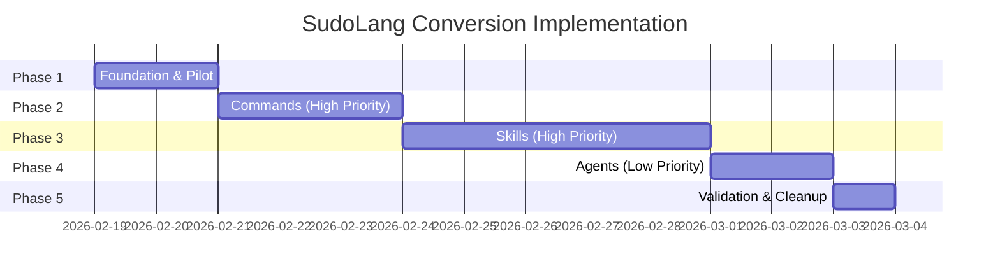
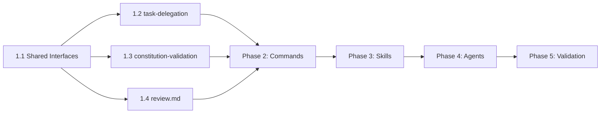

# Implementation Plan

## Validation Checklist

### CRITICAL GATES (Must Pass)

- [x] All phases have clear entry/exit criteria
- [x] Every task maps to PRD acceptance criteria or SDD interface
- [x] No circular dependencies between tasks
- [x] All tasks have verifiable deliverables
- [x] **User confirms plan before execution**

### QUALITY CHECKS (Should Pass)

- [x] Tasks are sized for single-session completion
- [x] High-risk tasks have validation steps
- [x] Dependencies are explicit between tasks
- [x] Parallel work streams are identified
- [x] Rollback strategy exists for each phase

---

## Phase Overview

## Phase 1: Foundation & Pilot Conversion

**Goal:** Establish conversion patterns with pilot files, create shared interfaces

**Entry Criteria:**
- SDD approved with all ADRs confirmed ✅
- PRD requirements understood ✅

**Exit Criteria:**
- 3 pilot files converted successfully
- Shared interface file created
- Conversion patterns validated

### Task 1.1: Create Shared Interfaces Library
**Priority:** HIGH | **Effort:** Medium | **Risk:** Low

Create a shared SudoLang interfaces file for reusable patterns.

**Deliverables:**
- `frameworks/the-startup/skill/shared/interfaces.sudo.md` (new file)

**Content includes:**
- TaskPrompt interface (FOCUS/EXCLUDE template)
- ValidationResult interface
- ConstitutionLevel enum
- PhaseState interface

**Acceptance Criteria:**
- [ref: PRD Feature 7 - Shared Interface Library]
- Interface definitions follow SudoLang spec
- All 6 TaskPrompt sections defined as typed properties

---

### Task 1.2: Pilot - Convert task-delegation/SKILL.md
**Priority:** HIGH | **Effort:** High | **Risk:** Medium

Convert the largest skill file (957 lines) as comprehensive pilot.

**Patterns to convert:**
- FOCUS/EXCLUDE template → TaskPrompt interface usage
- Parallel vs Sequential decision matrix → `match` expression
- Validation checklist → `require`/`warn` constraints
- Execution mode selection → Pattern matching

**Deliverables:**
- `frameworks/the-startup/skill/task-delegation/SKILL.md` (modified)

**Acceptance Criteria:**
- [ref: PRD Features 1, 2, 3]
- [ref: SDD Pattern 1, 2, 3]
- YAML frontmatter preserved exactly
- Decision matrices produce equivalent outcomes
- Natural language prose sections preserved

**Validation:**
- Manual review of before/after diff
- Verify `skill()` call still works

---

### Task 1.3: Pilot - Convert constitution-validation/SKILL.md
**Priority:** HIGH | **Effort:** Medium | **Risk:** Medium

Convert skill with L1/L2/L3 level system and pseudocode algorithms.

**Patterns to convert:**
- L1/L2/L3 table → ConstitutionLevel enum with behavior
- parse_constitution pseudocode → SudoLang `fn`
- Validation checklist → `require`/`warn` constraints
- Cycle workflow → State + Constraints

**Deliverables:**
- `frameworks/the-startup/skill/constitution-validation/SKILL.md` (modified)

**Acceptance Criteria:**
- [ref: PRD Feature 2]
- [ref: SDD Patterns 2, 5, 6]
- Level behaviors preserve exact semantics
- Pseudocode converts to valid SudoLang functions

**Validation:**
- Manual review comparing level enforcement logic

---

### Task 1.4: Pilot - Convert review.md Command
**Priority:** HIGH | **Effort:** Medium | **Risk:** Low

Convert command file with decision matrix for verdict determination.

**Patterns to convert:**
- Verdict decision matrix → `match` expression with `determineVerdict()`
- Review checklist → `require`/`warn` constraints
- Agent delegation template → TaskPrompt interface

**Deliverables:**
- `frameworks/the-startup/command/review.md` (modified)

**Acceptance Criteria:**
- [ref: PRD Feature 1]
- [ref: SDD Pattern 1]
- Decision matrix produces identical verdicts
- YAML frontmatter preserved

**Validation:**
- Test all verdict scenarios manually

---

## Phase 2: Command Files (HIGH Priority)

**Goal:** Convert all 10 command files

**Entry Criteria:**
- Phase 1 complete
- Pilot patterns validated

**Exit Criteria:**
- All 10 command files converted
- All decision matrices converted to pattern matching
- All workflow phases have state constraints

### Task 2.1: Convert implement.md
**Priority:** HIGH | **Effort:** High | **Risk:** Medium

Core orchestration command with workflow phases and task delegation.

**Patterns to convert:**
- 5 workflow phases → State machine with constraints
- Task delegation patterns → TaskPrompt interface usage
- Checkpoint logic → `/checkpoint` command

**Deliverables:**
- `frameworks/the-startup/command/implement.md` (modified)

**Acceptance Criteria:**
- [ref: PRD Feature 5 - Workflow Phase State Machine]
- [ref: SDD Pattern 4]
- Phase transitions explicitly defined
- User confirmation checkpoints are state boundaries

---

### Task 2.2: Convert specify.md
**Priority:** HIGH | **Effort:** Medium | **Risk:** Low

Specification workflow with phase progression.

**Patterns to convert:**
- PRD → SDD → PLAN workflow phases → State machine
- Validation gates → `require` constraints

**Deliverables:**
- `frameworks/the-startup/command/specify.md` (modified)

---

### Task 2.3: Convert debug.md
**Priority:** HIGH | **Effort:** Medium | **Risk:** Low

Investigation workflow with structured debugging phases.

**Patterns to convert:**
- Investigation phases → State machine
- Hypothesis formation → Structured process

**Deliverables:**
- `frameworks/the-startup/command/debug.md` (modified)

---

### Task 2.4: Convert constitution.md
**Priority:** MEDIUM | **Effort:** Low | **Risk:** Low

Constitution enforcement command.

**Deliverables:**
- `frameworks/the-startup/command/constitution.md` (modified)

---

### Task 2.5: Convert validate.md
**Priority:** MEDIUM | **Effort:** Low | **Risk:** Low

Validation modes and checks.

**Deliverables:**
- `frameworks/the-startup/command/validate.md` (modified)

---

### Task 2.6: Convert refactor.md
**Priority:** MEDIUM | **Effort:** Low | **Risk:** Low

Refactoring workflow.

**Deliverables:**
- `frameworks/the-startup/command/refactor.md` (modified)

---

### Task 2.7: Convert simplify.md
**Priority:** MEDIUM | **Effort:** Low | **Risk:** Low

Complexity review command.

**Deliverables:**
- `frameworks/the-startup/command/simplify.md` (modified)

---

### Task 2.8: Convert document.md
**Priority:** LOW | **Effort:** Low | **Risk:** Low

Documentation sync command.

**Deliverables:**
- `frameworks/the-startup/command/document.md` (modified)

---

### Task 2.9: Convert analyze.md
**Priority:** LOW | **Effort:** Low | **Risk:** Low

Analysis workflow command.

**Deliverables:**
- `frameworks/the-startup/command/analyze.md` (modified)

---

## Phase 3: Skill Files (HIGH Priority)

**Goal:** Convert all 42 skill directories

**Entry Criteria:**
- Phase 2 complete
- Command conversions validated

**Exit Criteria:**
- All skill SKILL.md files converted
- Shared interfaces referenced where applicable
- All pseudocode converted to SudoLang functions

### Task 3.1: Convert High-Value Skills (8 files)
**Priority:** HIGH | **Effort:** High | **Risk:** Medium

Skills with significant code-like patterns:
1. `implementation-planning/SKILL.md` - TDD phases, validation checklist
2. `specification-management/SKILL.md` - Spec workflow
3. `agent-coordination/SKILL.md` - Phase execution
4. `git-workflow/SKILL.md` - Git operations
5. `architecture-design/SKILL.md` - Templates
6. `requirements-analysis/SKILL.md` - Templates
7. `bug-diagnosis/SKILL.md` - Debugging methodology
8. `drift-detection/SKILL.md` - Drift handling

**Deliverables:**
- 8 skill files modified

---

### Task 3.2: Convert Skills with Decision Logic (10 files)
**Priority:** MEDIUM | **Effort:** Medium | **Risk:** Low

Skills with decision tables or conditional logic:
1. `code-quality-review/SKILL.md`
2. `security-assessment/SKILL.md`
3. `test-design/SKILL.md`
4. `safe-refactoring/SKILL.md`
5. `error-recovery/SKILL.md`
6. `performance-analysis/SKILL.md`
7. `accessibility-design/SKILL.md`
8. `api-contract-design/SKILL.md`
9. `data-modeling/SKILL.md`
10. `domain-driven-design/SKILL.md`

**Deliverables:**
- 10 skill files modified

---

### Task 3.3: Convert Skills with Checklists (12 files)
**Priority:** MEDIUM | **Effort:** Medium | **Risk:** Low

Skills primarily containing validation checklists:
1. `implementation-verification/SKILL.md`
2. `specification-validation/SKILL.md`
3. `pattern-detection/SKILL.md`
4. `codebase-analysis/SKILL.md`
5. `codebase-navigation/SKILL.md`
6. `documentation-extraction/SKILL.md`
7. `documentation-sync/SKILL.md`
8. `knowledge-capture/SKILL.md`
9. `context-preservation/SKILL.md`
10. `tech-stack-detection/SKILL.md`
11. `coding-conventions/SKILL.md`
12. `vibe-security/SKILL.md`

**Deliverables:**
- 12 skill files modified

---

### Task 3.4: Convert Remaining Skills (10 files)
**Priority:** LOW | **Effort:** Low | **Risk:** Low

Skills with minimal code-like patterns (mostly prose):
1. `architecture-selection/SKILL.md` - Also has ASCII diagrams → Mermaid
2. `deployment-pipeline-design/SKILL.md`
3. `observability-design/SKILL.md`
4. `requirements-elicitation/SKILL.md`
5. `user-insight-synthesis/SKILL.md`
6. `user-research/SKILL.md`
7. `feature-prioritization/SKILL.md`
8. `technical-writing/SKILL.md`
9. `code-review/SKILL.md`
10. `testing/SKILL.md`

**Deliverables:**
- 10 skill files modified

---

## Phase 4: Agent Files (LOW Priority)

**Goal:** Convert all 35 agent files

**Entry Criteria:**
- Phase 3 complete

**Exit Criteria:**
- All agent files reviewed
- Minimal conversion applied (agents are mostly prose)
- YAML frontmatter preserved

### Task 4.1: Convert Primary Agents (2 files)
**Priority:** MEDIUM | **Effort:** Low | **Risk:** Low

1. `the-chief.md` - Primary orchestrator
2. `the-meta-agent.md` - Agent generation

**Patterns to convert:**
- Constraint lists → SudoLang constraints
- Any decision logic → Pattern matching

**Deliverables:**
- 2 agent files modified

---

### Task 4.2: Convert Specialist Agent Groups (33 files)
**Priority:** LOW | **Effort:** Medium | **Risk:** Low

Convert in parallel batches:
- `the-analyst/` (4 agents)
- `the-architect/` (6 agents)
- `the-designer/` (4 agents)
- `the-platform-engineer/` (9 agents)
- `the-qa-engineer/` (4 agents)
- `the-software-engineer/` (6 agents)

**Note:** Most agents are prose-heavy. Apply minimal conversion:
- Convert any checklists to constraints
- Preserve natural language instructions

**Deliverables:**
- 33 agent files modified (light touch)

---

## Phase 5: Validation & Cleanup

**Goal:** Validate all conversions, clean up any issues

**Entry Criteria:**
- All files converted

**Exit Criteria:**
- All files pass markdown lint
- Cross-file references validated
- Documentation updated

### Task 5.1: Validate Cross-File References
**Priority:** HIGH | **Effort:** Low | **Risk:** Low

Verify:
- All `skill({ name: "X" })` calls resolve
- Agent `skills:` lists reference valid skills
- Shared interface imports work

**Deliverables:**
- Validation report

---

### Task 5.2: Run Markdown Linting
**Priority:** MEDIUM | **Effort:** Low | **Risk:** Low

Run `markdownlint` across all converted files.

**Deliverables:**
- All files pass lint
- Any issues fixed

---

### Task 5.3: Update Spec README
**Priority:** LOW | **Effort:** Low | **Risk:** Low

Document:
- Conversion complete
- Any decisions made during implementation
- Known limitations

**Deliverables:**
- `docs/specs/001-sudolang-conversion/README.md` updated

---

## Dependency Graph

## Risk Mitigation

| Risk | Mitigation |
|------|------------|
| Semantic drift in decision matrices | Manual before/after comparison for each conversion |
| Breaking `skill()` calls | Test skill loading after each file conversion |
| Large file conversion errors | Convert in small sections, commit frequently |
| YAML frontmatter corruption | Extract frontmatter before conversion, restore exactly |

## Rollback Strategy

Each phase can be rolled back independently:
1. **Git-based rollback**: Each phase should be a separate commit
2. **File-level rollback**: Individual files can be reverted from git history
3. **Abort criteria**: If 3+ files fail validation in a phase, halt and review approach

---

## Execution Notes

### Parallelization Opportunities

- Tasks 1.2, 1.3, 1.4 can run in parallel (different files)
- Tasks 2.4-2.9 can run in parallel (independent commands)
- Task 3.1-3.4 can run in parallel batches
- Task 4.2 can be highly parallelized (33 independent files)

### TDD Approach per Task

Each conversion task follows:
1. **Prime**: Read source file, identify patterns
2. **Test**: Define expected SudoLang output for key patterns
3. **Implement**: Apply conversion rules
4. **Validate**: Compare behavior, verify frontmatter

---

## Summary

| Phase | Files | Priority | Estimated Effort |
|-------|-------|----------|------------------|
| Phase 1: Foundation | 4 | HIGH | Medium |
| Phase 2: Commands | 9 | HIGH | Medium |
| Phase 3: Skills | 40 | HIGH | High |
| Phase 4: Agents | 35 | LOW | Low |
| Phase 5: Validation | - | HIGH | Low |
| **Total** | **88** | - | - |

Note: Some skill files were already converted in Phase 1 pilots (task-delegation, constitution-validation).
