# Solution Design Document

## Validation Checklist

### CRITICAL GATES (Must Pass)

- [x] All required sections are complete
- [x] No [NEEDS CLARIFICATION] markers remain
- [x] Architecture pattern is clearly stated with rationale
- [x] **All architecture decisions confirmed by user**
- [x] Every interface has specification

### QUALITY CHECKS (Should Pass)

- [x] All context sources are listed with relevance ratings
- [x] Project commands are discovered from actual project files
- [x] Constraints → Strategy → Design → Implementation path is logical
- [x] Every component in diagram has directory mapping
- [x] Error handling covers all error types
- [x] Quality requirements are specific and measurable
- [x] Component names consistent across diagrams
- [x] A developer could implement from this design

---

## Constraints

**CON-1: Markdown Compatibility**
- Converted files MUST remain valid Markdown
- SudoLang code MUST be wrapped in fenced code blocks (```sudolang)
- Natural language prose sections preserved as standard Markdown

**CON-2: YAML Frontmatter Preservation**
- Exact key names (`description`, `allowed-tools`, `mode`, `skills`) MUST be preserved
- Key order and structure MUST match existing format
- Frontmatter MUST NOT be converted to SudoLang

**CON-3: Cross-File Dependencies**
- `skill({ name: "X" })` call syntax MUST remain functional
- Agent `skills:` comma-separated lists MUST continue working
- Spec directory conventions (`docs/specs/[NNN]-[name]/`) MUST be preserved

**CON-4: Naming Conventions**
- Kebab-case for skill/agent references (e.g., `task-delegation`)
- Spec IDs as 3-digit zero-padded numbers (`001`, `002`)
- File naming patterns MUST be preserved

## Implementation Context

### Required Context Sources

#### Documentation Context
```yaml
- doc: https://github.com/paralleldrive/sudolang/blob/main/sudolang.sudo.md
  relevance: CRITICAL
  why: "SudoLang specification - defines all syntax and features"

- doc: frameworks/the-startup/skill/task-delegation/SKILL.md
  relevance: HIGH
  why: "Largest skill file (957 lines), defines FOCUS/EXCLUDE template pattern"

- doc: frameworks/the-startup/command/implement.md
  relevance: HIGH
  why: "Core orchestration command, demonstrates workflow phases"
```

#### Code Context
```yaml
- file: frameworks/the-startup/agent/the-chief.md
  relevance: HIGH
  why: "Primary agent example with mode: primary"

- file: frameworks/the-startup/skill/constitution-validation/SKILL.md
  relevance: HIGH
  why: "Contains L1/L2/L3 level system, pseudocode algorithms"

- file: frameworks/the-startup/command/review.md
  relevance: HIGH
  why: "Contains decision matrix for verdict determination"
```

### Implementation Boundaries

- **Must Preserve**: YAML frontmatter contracts, file organization, kebab-case naming
- **Can Modify**: Code blocks, decision tables, templates, workflow descriptions, checklists
- **Must Not Touch**: spec.py script (external dependency), directory structure

### Project Commands

```bash
# No build system - these are documentation files
# Validation can use diff comparison
Validate: diff original.md converted.md (for manual review)
Lint: markdownlint *.md (standard markdown linting)
```

## Solution Strategy

**Architecture Pattern: Hybrid Document Transformation**

This is a documentation refactoring project, not a traditional software architecture. The approach:

1. **Preserve Structure**: Keep Markdown document structure, section headers, prose descriptions
2. **Transform Selectively**: Convert only code-like patterns to SudoLang syntax
3. **Encapsulate Changes**: Wrap SudoLang in fenced code blocks
4. **Maintain Compatibility**: Ensure files work with existing tooling

**Integration Approach:**
- File-by-file conversion without breaking cross-file references
- Converted patterns remain invocable by existing `skill()` calls
- Output formats maintain emoji conventions and placeholder syntax

**Justification:**
- SudoLang is natively Markdown-compatible
- LLMs interpret SudoLang without explicit specification
- Incremental conversion reduces risk of semantic drift

## Building Block View

### Pattern Categories


### Directory Map

```
frameworks/the-startup/
├── agent/                          # 35 files - LOW priority conversion
│   ├── the-chief.md                # Primary agent
│   ├── the-meta-agent.md           # Primary agent
│   ├── the-analyst/                # 4 subagents
│   ├── the-architect/              # 6 subagents
│   ├── the-designer/               # 4 subagents
│   ├── the-platform-engineer/      # 9 subagents
│   ├── the-qa-engineer/            # 4 subagents
│   └── the-software-engineer/      # 6 subagents
│
├── command/                        # 10 files - HIGH priority conversion
│   ├── implement.md                # Workflow phases, task delegation
│   ├── specify.md                  # Workflow phases
│   ├── review.md                   # Decision matrix
│   ├── debug.md                    # Investigation workflow
│   ├── constitution.md             # L1/L2/L3 enforcement
│   ├── validate.md                 # Validation modes
│   ├── refactor.md                 # Refactoring workflow
│   ├── simplify.md                 # Complexity review
│   ├── document.md                 # Documentation sync
│   └── analyze.md                  # Analysis workflow
│
└── skill/                          # 42 directories - HIGH priority conversion
    ├── task-delegation/            # FOCUS/EXCLUDE template (957 lines)
    ├── constitution-validation/    # L1/L2/L3 levels, rule parsing
    ├── implementation-planning/    # TDD phases, validation checklist
    ├── specification-management/   # Spec workflow
    ├── agent-coordination/         # Phase execution
    ├── git-workflow/               # Git operations
    ├── architecture-design/        # Templates
    ├── requirements-analysis/      # Templates
    └── [34 more skill directories]
```

## Interface Specifications

### Pattern 1: Decision Matrix → Pattern Matching

**Source Pattern** (Markdown Table):
```markdown
| Critical | High | Decision |
|----------|------|----------|
| > 0 | Any | REQUEST CHANGES |
| 0 | > 3 | REQUEST CHANGES |
| 0 | 1-3 | APPROVE WITH COMMENTS |
| 0 | 0 | APPROVE |
```

**Target Pattern** (SudoLang):
```sudolang
fn determineVerdict(findings) {
  match (findings) {
    case { critical: c } if c > 0 => {
      verdict: "REQUEST_CHANGES",
      emoji: "🔴",
      action: "Address critical issues first"
    }
    case { critical: 0, high: h } if h > 3 => {
      verdict: "REQUEST_CHANGES",
      emoji: "🔴",
      action: "Too many high-severity issues"
    }
    case { critical: 0, high: 1..3 } => {
      verdict: "APPROVE_WITH_COMMENTS",
      emoji: "🟡",
      action: "Address high issues before merge"
    }
    default => {
      verdict: "APPROVE",
      emoji: "✅",
      action: "Ready to merge"
    }
  }
}
```

**Conversion Rules:**
1. Each table row becomes a `case` clause
2. Conditions in cells become guard expressions (`if` predicates)
3. "Any" values are omitted from the pattern
4. Ranges use `..` syntax (e.g., `1..3`)
5. Default/fallback row becomes `default =>` case
6. Preserve emoji semantics in output objects

---

### Pattern 2: Validation Checklist → Requirements/Constraints

**Source Pattern** (Markdown Checklist):
```markdown
## Success Criteria

A plan is complete when:

- [ ] A developer can follow it independently
- [ ] Every task produces a verifiable deliverable
- [ ] All PRD acceptance criteria map to specific tasks
- [ ] Dependencies are explicit (no circular dependencies)
```

**Target Pattern** (SudoLang):
```sudolang
ImplementationPlan {
  require {
    Every task produces a verifiable deliverable
      => throw "Task must have verifiable outcome"
    All PRD acceptance criteria map to specific tasks
      => throw "Unmapped acceptance criteria: $missing"
    Dependencies are explicit with no circular dependencies
      => throw "Circular dependency detected: $cycle"
  }
  
  warn {
    A developer should be able to follow the plan independently
  }
  
  constraints {
    Avoid tracking TDD substeps as separate items
    Include Prime/Test/Implement/Validate phases in task body
    Reference specification sections with [ref: ...]
  }
}
```

**Conversion Rules:**
1. Critical/blocking items become `require` with `throw`
2. Should-pass items become `warn` (reports but doesn't block)
3. Advisory/guidance items become `constraints`
4. Preserve natural language phrasing
5. Add specific error messages where applicable

---

### Pattern 3: FOCUS/EXCLUDE Template → Interface Definition

**Source Pattern** (Prose Template):
```markdown
```
FOCUS: [Task description]
  - [Deliverable 1]
  - [Deliverable 2]

EXCLUDE:
  - [Things to avoid]

CONTEXT:
  - Self-prime from: [path]

OUTPUT:
  - [Expected file paths]

SUCCESS:
  - [Criteria]

TERMINATION:
  - [Conditions]
```
```

**Target Pattern** (SudoLang):
```sudolang
interface TaskPrompt {
  focus: String           // Required: What to accomplish
  deliverables: String[]  // Required: Specific outcomes
  exclude: String[]       // Required: Out of scope items
  context: String[]       // Required: Background and constraints
  output: String[]        // Required: Expected file paths
  success: String[]       // Required: Completion criteria
  termination: String[]   // Required: Stop conditions
}

TaskDelegation {
  constraints {
    FOCUS must be specific and measurable
    EXCLUDE should prevent scope creep
    OUTPUT must include exact paths when creating files
    SUCCESS criteria must be objectively verifiable
    All sections required unless explicitly optional
  }
  
  /delegate task:TaskPrompt => """
    FOCUS: $task.focus
      ${ task.deliverables |> map(d => "- $d") |> join("\n") }
    
    EXCLUDE:
      ${ task.exclude |> map(e => "- $e") |> join("\n") }
    
    CONTEXT:
      ${ task.context |> map(c => "- $c") |> join("\n") }
    
    OUTPUT:
      ${ task.output |> map(o => "- $o") |> join("\n") }
    
    SUCCESS:
      ${ task.success |> map(s => "- $s") |> join("\n") }
    
    TERMINATION:
      ${ task.termination |> map(t => "- $t") |> join("\n") }
  """
}
```

**Conversion Rules:**
1. Template sections become interface properties
2. Required sections get explicit `String` or `String[]` types
3. Constraints capture validation rules
4. `/delegate` command generates backwards-compatible text output
5. Template strings use `${}` interpolation with pipe operators

---

### Pattern 4: Workflow Phases → State + Constraints

**Source Pattern** (Numbered Phases):
```markdown
### Phase 0: Git Setup (Optional)
- Call: `skill({ name: "git-workflow" })`
- Check if git repository exists

### Phase 1: Initialize and Analyze Plan
- Call: `skill({ name: "specification-management" })`
- Validate: PLAN.md exists
- Load ONLY Phase 1 tasks into todowrite

### Phase 2+: Phase-by-Phase Execution
- At phase start: Clear previous todowrite
- During execution: Delegate ALL tasks to subagents
- At checkpoint: Call `skill({ name: "drift-detection" })`
```

**Target Pattern** (SudoLang):
```sudolang
ImplementWorkflow {
  State {
    currentPhase: "init"
    completedPhases: []
    blockers: []
    todoItems: []
  }
  
  Phases {
    init => gitSetup | analyzeSpec
    gitSetup => analyzeSpec    // Optional, can skip
    analyzeSpec => execution
    execution => execution | checkpoint | blocked
    checkpoint => execution | completion
    blocked => execution | abort
    completion => done
  }
  
  constraints {
    Cannot skip to completion without all phases complete
    User confirmation required at phase boundaries
    Blocked state requires explicit resolution
    Clear previous todowrite before loading new phase
    Load only current phase tasks into todowrite
  }
  
  /advance => transition to next valid phase
  /checkpoint => {
    skill({ name: "drift-detection" })
    skill({ name: "constitution-validation" }) if CONSTITUTION.md exists
    present phase summary to user
    await user confirmation
  }
  /block reason => {
    blockers.push(reason)
    present options: [retry, skip, abort, assist]
  }
}
```

**Conversion Rules:**
1. Phase headers become state names
2. Phase transitions become explicit arrows (`=>`)
3. Optional phases marked with alternative paths (`|`)
4. Phase behavior becomes constraints
5. User confirmation points become explicit `/checkpoint` commands
6. Preserve `skill()` call syntax within commands

---

### Pattern 5: L1/L2/L3 Level System → Enum with Behavior

**Source Pattern** (Table):
```markdown
| Level | Blocking | Autofix | Use Case |
|-------|----------|---------|----------|
| L1    | Yes      | Yes     | Critical |
| L2    | Yes      | No      | Important |
| L3    | No       | No      | Advisory |
```

**Target Pattern** (SudoLang):
```sudolang
ConstitutionLevel {
  L1 {
    name: "Must"
    blocking: true
    autofix: true
    behavior: "AI automatically fixes before proceeding"
    useCase: "Critical rules - security, correctness, architecture"
  }
  
  L2 {
    name: "Should"
    blocking: true
    autofix: false
    behavior: "Reports violation, requires human action"
    useCase: "Important rules requiring manual attention"
  }
  
  L3 {
    name: "May"
    blocking: false
    autofix: false
    behavior: "Optional improvement, can be ignored"
    useCase: "Advisory - style preferences, suggestions"
  }
  
  fn enforce(rule, violation) {
    match (rule.level) {
      case L1 => autofix(violation) |> continue
      case L2 => report(violation) |> block |> awaitHuman
      case L3 => log(violation) |> continue
    }
  }
}
```

**Conversion Rules:**
1. Each level becomes a named object with properties
2. Boolean columns become `true`/`false` properties
3. Behavior description becomes explicit `behavior` property
4. Enforcement logic becomes a `match` function
5. Preserve level semantics exactly

---

### Pattern 6: Pseudocode → SudoLang Functions

**Source Pattern** (Pseudocode):
```markdown
```pseudocode
FUNCTION: parse_constitution(markdown_content)
  rules = []
  current_category = null

  FOR EACH section in markdown:
    IF section.header.level == 2:
      current_category = section.header.text
    ELSE IF section.header.level == 3:
      yaml_block = extract_yaml_code_block(section.content)
      IF yaml_block:
        rule = { ... }
        rules.append(rule)
  RETURN rules
```
```

**Target Pattern** (SudoLang):
```sudolang
fn parseConstitution(markdownContent) {
  rules = []
  currentCategory = null
  
  for each section in markdownContent.sections {
    match (section.header.level) {
      case 2 => currentCategory = section.header.text
      case 3 => {
        yamlBlock = extractYamlCodeBlock(section.content)
        if (yamlBlock) {
          rule = {
            id: generateRuleId(currentCategory, rules.length),
            name: section.header.text,
            category: currentCategory,
            level: yamlBlock.level,
            pattern: yamlBlock.pattern,
            check: yamlBlock.check,
            scope: yamlBlock.scope,
            message: yamlBlock.message,
            blocking: yamlBlock.level in ["L1", "L2"],
            autofix: yamlBlock.level == "L1"
          }
          rules.push(rule)
        }
      }
    }
  }
  
  rules
}
```

**Conversion Rules:**
1. `FUNCTION` becomes `fn` with camelCase name
2. `FOR EACH` becomes `for each`
3. `IF/ELSE IF` becomes `match` with cases
4. Assignments use `=`
5. Return is implicit (last expression) or explicit
6. Preserve logic structure exactly

---

### Pattern 7: ASCII Diagrams → Mermaid

**Source Pattern** (ASCII):
```
┌─────────────────────────────────────────────────────────────┐
│                    Monolithic Application                    │
├─────────────────────────────────────────────────────────────┤
│  ┌─────────────┐  ┌─────────────┐  ┌─────────────┐         │
│  │  Web UI     │  │  API Layer  │  │  Admin UI   │         │
│  └─────────────┘  └─────────────┘  └─────────────┘         │
│  ┌─────────────────────────────────────────────────┐       │
│  │              Business Logic Layer                │       │
│  └─────────────────────────────────────────────────┘       │
│  ┌─────────────────────────────────────────────────┐       │
│  │                Data Access Layer                 │       │
│  └─────────────────────────────────────────────────┘       │
└─────────────────────────────────────────────────────────────┘
                              │
                    ┌─────────┴─────────┐
                    │     Database       │
                    └───────────────────┘
```

**Target Pattern** (Mermaid):


**Conversion Rules:**
1. Box structures become `subgraph` groupings
2. Individual boxes become nodes with labels
3. Vertical relationships become `-->` arrows
4. Preserve logical groupings (layers, sections)
5. Use descriptive node IDs for readability

---

## Runtime View

### Conversion Workflow

```mermaid
sequenceDiagram
    actor Developer
    participant Converter as Conversion Agent
    participant File as Framework File
    participant Validator as Validation
    
    Developer->>Converter: /convert [file-path]
    Converter->>File: Read source file
    File-->>Converter: Markdown content
    
    Converter->>Converter: Identify patterns
    Note over Converter: Decision tables?<br/>Checklists?<br/>Templates?<br/>Phases?
    
    loop For each pattern
        Converter->>Converter: Apply conversion rule
        Converter->>Converter: Generate SudoLang
    end
    
    Converter->>File: Write converted file
    Converter->>Validator: Validate conversion
    Validator-->>Converter: Validation result
    
    alt Validation passes
        Converter-->>Developer: ✅ Conversion complete
    else Validation fails
        Converter-->>Developer: ❌ Issues found
        Converter->>Developer: Present diff for review
    end
```



### Error Handling

- **Invalid source pattern**: Skip pattern, preserve original, warn user
- **Ambiguous conversion**: Present options to user, await decision
- **Semantic drift detected**: Flag for manual review
- **File write failure**: Rollback, preserve original

## Architecture Decisions

- [x] **ADR-1: Hybrid Approach** - Keep prose alongside SudoLang
  - Rationale: Maintains human readability while adding formal structure
  - Trade-offs: Files may be longer; requires learning both formats
  - User confirmed: ✅ 2026-02-19

- [x] **ADR-2: Fenced Code Blocks** - Wrap SudoLang in ```sudolang fences
  - Rationale: Standard Markdown remains valid; clear visual separation
  - Trade-offs: More visual noise; requires code block parsing
  - User confirmed: ✅ 2026-02-19

- [x] **ADR-3: Preserve YAML Frontmatter** - Do not convert frontmatter to SudoLang
  - Rationale: System tooling depends on exact YAML format
  - Trade-offs: Two syntax formats in same file
  - User confirmed: ✅ 2026-02-19

- [x] **ADR-4: Pattern-Selective Conversion** - Only convert identified patterns
  - Rationale: Natural language instructions already work with LLMs
  - Trade-offs: Inconsistent style within files; judgment calls on what to convert
  - User confirmed: ✅ 2026-02-19

- [x] **ADR-5: Backwards-Compatible Output** - Include `/generate` commands
  - Rationale: Interfaces can output traditional text format for compatibility
  - Trade-offs: Slight redundancy; must maintain both formats
  - User confirmed: ✅ 2026-02-19

## Quality Requirements

- **Semantic Equivalence**: Decision matrices must produce identical outputs
- **Structural Validity**: All files must pass markdown lint
- **LLM Interpretability**: Converted patterns must be executable by LLMs
- **Human Readability**: Developers must understand converted patterns

## Acceptance Criteria

**Main Flow Criteria:**
- [x] WHEN a decision table is converted, THE SYSTEM SHALL produce a pattern match that returns equivalent outcomes for all input combinations
- [x] WHEN a validation checklist is converted, THE SYSTEM SHALL preserve all items as require/warn/constraint statements
- [x] THE SYSTEM SHALL preserve all YAML frontmatter exactly as-is

**Error Handling Criteria:**
- [x] WHEN an unrecognized pattern is encountered, THE SYSTEM SHALL preserve original text and warn user
- [x] IF semantic drift is detected, THEN THE SYSTEM SHALL flag for manual review

**Edge Case Criteria:**
- [x] WHILE converting nested code blocks, THE SYSTEM SHALL escape inner fences correctly
- [x] IF emoji has semantic meaning, THEN THE SYSTEM SHALL preserve emoji in converted output

## Glossary

### SudoLang Terms

| Term | Definition | Context |
|------|------------|---------|
| Interface | Typed structure definition | Defines template/data shapes |
| Constraint | Continuously enforced rule | Replaces validation checklists |
| Match | Pattern matching expression | Replaces decision tables |
| Pipe (`\|>`) | Function composition operator | Chains transformations |

### Framework Terms

| Term | Definition | Context |
|------|------------|---------|
| FOCUS/EXCLUDE | Task delegation template pattern | Core orchestration mechanism |
| L1/L2/L3 | Constitution rule levels | Enforcement severity |
| Phase | Workflow stage with checkpoint | Command execution structure |
