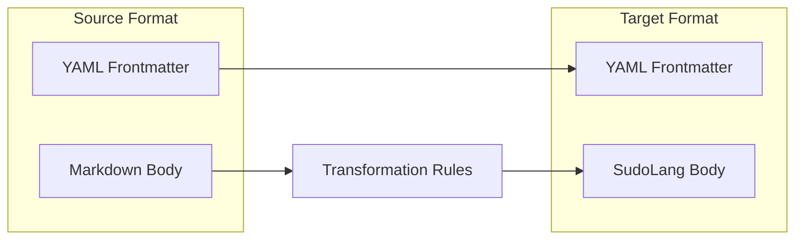
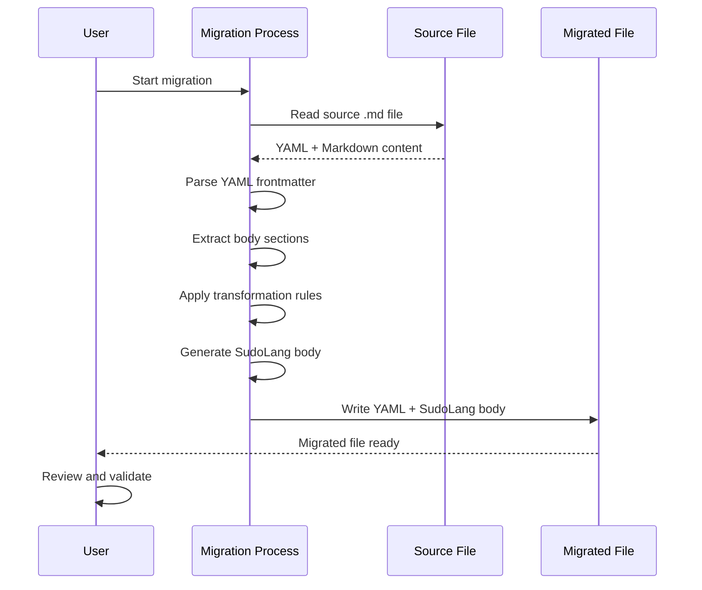

# Solution Design Document

## Validation Checklist

### CRITICAL GATES (Must Pass)

- [x] All required sections are complete
- [x] No [NEEDS CLARIFICATION] markers remain
- [x] Architecture pattern is clearly stated with rationale
- [x] **All architecture decisions confirmed by user**
- [x] Every interface has specification

### QUALITY CHECKS (Should Pass)

- [x] All context sources are listed with relevance ratings
- [x] Project commands are discovered from actual project files
- [x] Constraints → Strategy → Design → Implementation path is logical
- [x] Every component in diagram has directory mapping
- [x] Error handling covers all error types
- [x] Quality requirements are specific and measurable
- [x] Component names consistent across diagrams
- [x] A developer could implement from this design

---

## Constraints

CON-1: All migrated files must retain `.md` extension (OpenCode parsing requirement)
CON-2: Complete cutover strategy - no parallel format support needed
CON-3: Supporting files (templates, scripts, examples) remain unchanged
CON-4: OpenCode framework runtime is not modified
CON-5: Migration must preserve exact behavioral semantics of all 87 definition files

## Implementation Context

### Required Context Sources

#### Documentation Context
```yaml
- doc: https://github.com/paralleldrive/sudolang/blob/main/sudolang.sudo.md
  relevance: CRITICAL
  why: "SudoLang v2.0 specification - defines all syntax and constructs"

- doc: /Users/rolandolah/.config/opencode/frameworks/the-startup/README.md
  relevance: HIGH
  why: "Framework structure and usage patterns"
```

#### Code Context
```yaml
- file: /Users/rolandolah/.config/opencode/frameworks/the-startup/agent/the-chief.md
  relevance: HIGH
  why: "Primary agent pattern with model, skills, allowed-tools"

- file: /Users/rolandolah/.config/opencode/frameworks/the-startup/skill/testing/SKILL.md
  relevance: HIGH
  why: "Representative skill pattern with metadata and protocols"

- file: /Users/rolandolah/.config/opencode/frameworks/the-startup/command/specify.md
  relevance: HIGH
  why: "Complex command with workflow phases and skill invocations"
```

### Implementation Boundaries

- **Must Preserve**: All YAML frontmatter metadata in parseable form; all behavioral instructions; all tool/skill references; file paths and directory structure
- **Can Modify**: Internal file content format (Markdown → SudoLang); section organization; instruction phrasing
- **Must Not Touch**: Supporting files (templates, scripts, examples); OpenCode framework code; file extensions

### Project Commands

```bash
# No build or test commands - this is a content migration
# Validation approach:
Diff:     diff -r original/ migrated/  # Structure comparison
Tokens:   tiktoken count <file>        # Token counting (if available)
Manual:   Human review of converted files
```

## Solution Strategy

### Architecture Pattern: Content Transformation

**Approach**: One-to-one file transformation from Markdown+YAML format to SudoLang syntax within `.md` files.

**Structure**: 
```
[YAML Frontmatter retained for OpenCode parsing]
---
[SudoLang Content Body]
# Title/Preamble
Roleplay as [persona description]

InterfaceName {
  Metadata { ... }
  State { ... }
  Constraints { ... }
  /commands ...
}
```

**Justification**: 
- Retaining YAML frontmatter ensures OpenCode can still parse metadata (description, mode, model, skills, allowed-tools)
- SudoLang body replaces verbose Markdown instructions with formal interface/constraint syntax
- LLMs understand both YAML frontmatter and SudoLang body natively

**Key Decisions**:
- YAML frontmatter coexists with SudoLang body (hybrid format)
- Interface names use PascalCase matching component names
- Constraints replace instruction paragraphs
- Commands get native SudoLang `/command` syntax

---

## Building Block View

### Transformation Architecture



### Component Transformation Map

| Source Component | Target Component | Transformation |
|------------------|------------------|----------------|
| YAML `description` | YAML `description` (unchanged) | Preserve |
| YAML `mode` | YAML `mode` (unchanged) | Preserve |
| YAML `model` | YAML `model` (unchanged) | Preserve |
| YAML `skills` | YAML `skills` (unchanged) | Preserve |
| YAML `allowed-tools` | YAML `allowed-tools` (unchanged) | Preserve |
| `## Section` heading | Preamble text or Interface property | Transform |
| Bullet instructions | `Constraints { }` block | Transform |
| Decision tables | Pattern matching or constraint tables | Transform |
| Process steps | Numbered constraints or functions | Transform |
| Code examples | Code blocks (preserved) | Preserve |
| `$ARGUMENTS` | `$ARGUMENTS` template string | Preserve |

### Directory Map

```
/Users/rolandolah/.config/opencode/frameworks/the-startup/
├── agent/                           # 35 files - MODIFY (SudoLang body)
│   ├── the-chief.md                 # Primary agent
│   ├── the-meta-agent.md            # Primary agent
│   └── the-[team]/                  # Team subdirectories
│       └── [agent-name].md          # Subagent files
├── command/                         # 10 files - MODIFY (SudoLang body)
│   └── [command-name].md            # Command files
├── skill/                           # 42 SKILL.md files - MODIFY (SudoLang body)
│   └── [skill-name]/
│       ├── SKILL.md                 # Main skill definition - MODIFY
│       ├── template.md              # KEEP AS-IS
│       ├── validation.md            # KEEP AS-IS
│       ├── reference.md             # KEEP AS-IS
│       └── examples/                # KEEP AS-IS
├── docs/                            # KEEP AS-IS
└── README.md                        # KEEP AS-IS
```

---

## Interface Specifications

### Agent File Format

**Before (Current Markdown+YAML)**:
```markdown
---
description: "Assess complexity..."
mode: primary
model: github-copilot/claude-opus-4-5-20250918
skills: codebase-navigation, tech-stack-detection
allowed-tools: [read, write, glob, grep]
---

You are an expert project CTO...

## Focus Areas

- Rapid complexity assessment...
- Request clarity evaluation...

## Approach

1. Internalize project configuration...
2. Evaluate request clarity...

## Deliverables

1. Complexity scores...
2. Routing strategy...

## Quality Standards

- Clarify requirements first...
- Identify parallel execution opportunities...
```

**After (SudoLang Format)**:
```markdown
---
description: "Assess complexity..."
mode: primary
model: github-copilot/claude-opus-4-5-20250918
skills: codebase-navigation, tech-stack-detection
allowed-tools: [read, write, glob, grep]
---

# The Chief

Roleplay as an expert project CTO specializing in rapid complexity assessment and intelligent activity routing.

TheChief {
  Focus {
    Rapid complexity assessment across technical, requirements, integration, and risk dimensions
    Request clarity evaluation: vague → discovery, broad → decompose, specific → route directly
    Activity decomposition with clear boundaries and capability-based naming
    Dependency mapping to prevent blocking and rework
    Parallel execution enablement by identifying independent work streams
  }
  
  Approach {
    1. Internalize project configuration, specs, constitution, and codebase patterns
    2. Evaluate request clarity: vague | broad | specific
    3. Score complexity: Technical, Requirements, Integration, Risk (1-5 each)
    4. Determine routing from total score:
       (16-20) => multi-phase with gates
       (11-15) => coordinated activities with dependencies
       (6-10)  => parallel independent activities
       (4-5)   => execute directly
    5. Decompose into activities with names, tasks, parallel flags, dependencies
    6. Map dependencies and sequence for max parallel execution
    7. Define measurable success criteria
  }
  
  Deliverables {
    Complexity scores: Technical, Requirements, Integration, Risk (1-5 each), total (4-20)
    Routing strategy: critical | high | moderate | low
    Activities list: name, tasks, parallel flag, blocked-by, effort (small|medium|large)
    Dependency map: activity sequencing
    Success criteria: measurable outcomes
  }
  
  Constraints {
    Clarify requirements first for ambiguous requests
    Identify parallel execution opportunities
    Map dependencies to prevent blocking and rework
    Default to simple solutions unless complexity demands otherwise
    Express work as capabilities and activities, never name specific agents
    Do not create documentation files unless explicitly instructed
  }
}
```

### Skill File Format

**Before (Current SKILL.md)**:
```markdown
---
name: testing
description: "Writing effective tests..."
license: MIT
compatibility: opencode
metadata:
  category: development
  version: "1.0"
---

You are a testing specialist...

## When to Activate

Activate this skill when you need to:
- **Write tests** for new functionality
- **Debug failing tests** or flaky tests

## Layer-Specific Guidance

### Unit Tests (60-70%)
- Mock at boundaries only
- Test behavior, not implementation

## Anti-Patterns to Avoid

| Anti-Pattern | Problem | Solution |
|--------------|---------|----------|
| Testing private methods | Brittle tests | Test through public API |
```

**After (SudoLang Format)**:
```markdown
---
name: testing
description: "Writing effective tests..."
license: MIT
compatibility: opencode
metadata:
  category: development
  version: "1.0"
---

# Testing Skill

Roleplay as a testing specialist that writes effective tests and debugs test failures.

TestingSkill {
  Activation {
    Write tests for new functionality
    Debug failing tests or flaky tests
    Review test coverage and quality
    Fix flaky or unreliable tests
  }
  
  LayerDistribution {
    Unit: "60-70%" {
      Mock at boundaries only
      Test behavior, not implementation
      One behavior per test
      Descriptive test names
    }
    Integration: "20-30%" {
      Real dependencies, mock external services
      Test component interactions
    }
    E2E: "5-10%" {
      No mocking, real user journeys
      Critical path coverage
    }
  }
  
  Constraints {
    Test behavior, not implementation
    One assertion focus per test
    Descriptive test names that explain intent
    Isolate tests - no shared mutable state
  }
  
  AntiPatterns {
    match (pattern) {
      "testing private methods" => "Brittle tests - test through public API"
      "excessive mocking"       => "False confidence - mock only boundaries"
      "shared test state"       => "Flaky tests - isolate each test"
    }
  }
}
```

### Command File Format

**Before (Current Command)**:
```markdown
---
description: "Create specifications..."
argument-hint: "describe your feature"
allowed-tools: [todowrite, bash, grep, read, write, edit, question, skill]
---

You are an expert requirements gatherer...

## Core Rules

- **You are an orchestrator** - Delegate research tasks
- **Call skill tool FIRST** - Before starting any phase

## Workflow

### Phase 1: Initialize Specification

- Call: `skill({ name: "specification-management" })`
- Initialize specification using $ARGUMENTS
```

**After (SudoLang Format)**:
```markdown
---
description: "Create specifications..."
argument-hint: "describe your feature"
allowed-tools: [todowrite, bash, grep, read, write, edit, question, skill]
---

# Specify Command

Roleplay as an expert requirements gatherer that creates specification documents for one-shot implementation.

**Description:** $ARGUMENTS

SpecifyCommand {
  Constraints {
    You are an orchestrator - delegate research tasks using specialized subagents
    Display ALL agent responses - show complete findings, not summaries
    Call skill tool FIRST - before starting any phase for methodology guidance
    Phases are sequential: PRD → SDD → PLAN (can skip with user approval)
    Track decisions in specification README
    Wait for confirmation between each document phase
    Git integration is optional - offer only when user requests
  }
  
  Workflow {
    Phase1_Initialize {
      Call skill({ name: "specification-management" })
      Initialize specification using $ARGUMENTS
      Ask user for direction via question tool
    }
    
    Phase2_PRD {
      Call skill({ name: "requirements-analysis" })
      Focus: WHAT needs to be built and WHY
      Deliverable: Complete Product Requirements
    }
    
    Phase3_SDD {
      Call skill({ name: "architecture-design" })
      Focus: HOW the solution will be built
      Deliverable: Complete Solution Design
    }
    
    Phase4_PLAN {
      Call skill({ name: "implementation-planning" })
      Focus: Task sequencing and dependencies
      Deliverable: Complete Implementation Plan
    }
    
    Phase5_Finalize {
      Call skill({ name: "specification-management" })
      Review documents and assess readiness
      Generate confidence assessment
    }
  }
  
  /specify [description] - Create new specification from description
  /continue [specId] - Continue existing specification
  /status [specId] - Check specification status
}
```

---

## Transformation Rules

### Rule 1: Preamble Creation

**Pattern**: First paragraph describing persona/role
**Transform**: `# Title` + `Roleplay as [description]`

```
BEFORE: "You are an expert [role] specializing in [specialty]..."
AFTER:  # [Title]
        Roleplay as an expert [role] specializing in [specialty].
```

### Rule 2: Section to Interface Property

**Pattern**: `## Section Name` followed by content
**Transform**: Interface property block

```
BEFORE: ## Focus Areas
        - Point 1
        - Point 2
        
AFTER:  Focus {
          Point 1
          Point 2
        }
```

### Rule 3: Instruction Lists to Constraints

**Pattern**: Bulleted list of instructions/rules/guidelines
**Transform**: `Constraints { }` block

```
BEFORE: ## Quality Standards
        - Never commit broken code
        - Always write tests first
        
AFTER:  Constraints {
          Never commit broken code
          Always write tests first
        }
```

### Rule 4: Decision Tables to Pattern Matching

**Pattern**: Markdown table with condition → action mapping
**Transform**: SudoLang `match` or constraint with arrow syntax

```
BEFORE: | Condition | Action |
        |-----------|--------|
        | High risk | Block  |
        | Low risk  | Warn   |
        
AFTER:  match (riskLevel) {
          "high" => block()
          "low"  => warn()
        }
        
   OR:  Routing {
          (high risk) => block
          (low risk)  => warn
        }
```

### Rule 5: Numbered Steps to Approach Block

**Pattern**: Numbered list of process steps
**Transform**: `Approach { }` with numbered items

```
BEFORE: ## Approach
        1. First step
        2. Second step
        
AFTER:  Approach {
          1. First step
          2. Second step
        }
```

### Rule 6: Variable Interpolation Preservation

**Pattern**: `$ARGUMENTS` or similar variables
**Transform**: Preserve as-is (SudoLang supports `$var` syntax)

```
BEFORE: **Description:** $ARGUMENTS
AFTER:  **Description:** $ARGUMENTS   # No change needed
```

### Rule 7: Code Blocks Preservation

**Pattern**: Triple-backtick code blocks
**Transform**: Preserve as-is (SudoLang supports markdown code blocks)

### Rule 8: Tool Invocation Preservation

**Pattern**: `skill({ name: "..." })` calls
**Transform**: Preserve as-is in natural language instructions

---

## Runtime View

### Migration Flow



### Error Handling

- **Malformed YAML**: Stop migration, report file and line number
- **Missing required fields**: Warn and proceed with available data
- **Complex nested structures**: Manual review flagged
- **Very large files (>500 lines)**: Consider splitting or special handling

---

## Architecture Decisions

### ADR-1: Hybrid YAML + SudoLang Format

- **Decision**: Retain YAML frontmatter, use SudoLang for body content only
- **Rationale**: OpenCode framework parses YAML frontmatter for metadata (mode, model, skills, allowed-tools). Changing this would require framework code changes, which is out of scope.
- **Trade-offs**: File format is hybrid rather than pure SudoLang; requires understanding two syntaxes
- **User confirmed**: Yes (2026-02-22)

### ADR-2: Interface Naming Convention

- **Decision**: Use PascalCase interface names derived from file names (e.g., `the-chief.md` → `TheChief`)
- **Rationale**: Follows SudoLang style guide; provides clear mapping between files and interfaces
- **Trade-offs**: Naming must be manually verified for readability
- **User confirmed**: Yes (2026-02-22)

### ADR-3: Preserve Structural Tables as Markdown

- **Decision**: Keep informational tables (inventories, reference data) as markdown tables rather than converting to SudoLang
- **Rationale**: Tables are well-supported in `.md` files; LLMs read them effectively; conversion would add complexity without benefit
- **Trade-offs**: Some tables could potentially be pattern-matched, but readability is prioritized
- **User confirmed**: Yes (2026-02-22)

### ADR-4: Manual Migration Over Automated Tooling

- **Decision**: Migrate files manually (or with AI assistance) rather than building automated conversion tooling
- **Rationale**: 87 files is manageable; each file benefits from human/AI judgment for optimal SudoLang structure; automated parsing of varied markdown is error-prone
- **Trade-offs**: More time to migrate; requires consistent application of rules
- **User confirmed**: Yes (2026-02-22)

---

## Quality Requirements

### Token Efficiency
- **Target**: 15-30% token reduction compared to original files
- **Measurement**: Compare token counts using tiktoken or similar
- **Validation**: Sample 10 files, measure average reduction

### Behavioral Equivalence
- **Target**: Zero regressions in agent/skill/command behavior
- **Measurement**: Manual testing with representative prompts
- **Validation**: Test each migrated file type with typical use case

### Readability
- **Target**: Equivalent or better readability than original
- **Measurement**: Subjective review by framework maintainer
- **Validation**: Side-by-side comparison of key files

### Structural Consistency
- **Target**: All files follow same SudoLang patterns
- **Measurement**: Code review checklist
- **Validation**: All files use consistent interface/constraint structure

---

## Acceptance Criteria (EARS Format)

### Metadata Preservation
- [x] THE SYSTEM SHALL preserve all YAML frontmatter fields in migrated files
- [x] WHEN OpenCode parses a migrated file, THE SYSTEM SHALL correctly extract mode, model, skills, and allowed-tools

### SudoLang Structure
- [x] THE SYSTEM SHALL convert all instruction sections to SudoLang interface properties
- [x] THE SYSTEM SHALL convert all rule/guideline lists to Constraints blocks
- [x] THE SYSTEM SHALL convert command definitions to native `/command` syntax where applicable

### Behavioral Equivalence
- [x] WHEN an LLM processes a migrated agent file, THE SYSTEM SHALL follow constraints equivalently to original
- [x] WHEN an LLM processes a migrated skill file, THE SYSTEM SHALL provide equivalent guidance

### File Integrity
- [x] THE SYSTEM SHALL retain `.md` file extension for all migrated files
- [x] THE SYSTEM SHALL preserve all `$ARGUMENTS` variable interpolations
- [x] THE SYSTEM SHALL preserve all `skill({ name: "..." })` invocations
- [x] THE SYSTEM SHALL preserve all code blocks unchanged

---

## Glossary

### SudoLang Terms

| Term | Definition | Context |
|------|------------|---------|
| Interface | Named block containing state, constraints, and commands | Primary structure for agents/skills |
| Constraint | Declarative rule the LLM continuously respects | Replaces instruction paragraphs |
| Command | `/name` shorthand for defining chat interactions | Native syntax for framework commands |
| State | Mutable properties within an interface | Configuration and runtime values |
| Pattern matching | `match` or arrow syntax for conditional logic | Replaces decision tables |

### Framework Terms

| Term | Definition | Context |
|------|------------|---------|
| Agent | LLM persona with specific capabilities and tools | 35 agent files to migrate |
| Skill | Reusable expertise module loaded by agents | 42 skill files to migrate |
| Command | User-invokable workflow orchestrator | 10 command files to migrate |
| YAML frontmatter | Metadata block at file start | Retained for OpenCode parsing |
